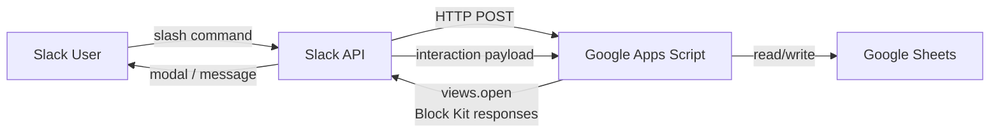
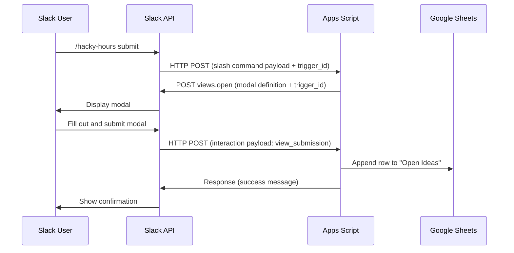

# ARCHITECTURE.md

**Level 2 — Design** | hacky-hours-bot

---

## System Overview

Three components connected by HTTP:

**Flow summary:**
1. User types a slash command in Slack
2. Slack sends an HTTP POST to the Apps Script web app URL
3. Apps Script parses the command, reads/writes Google Sheets, and responds
4. For `/hacky-hours submit`: Apps Script calls back to Slack to open a modal, then handles the submission payload when the user completes it

This is a **two-way integration** — Apps Script both receives requests from Slack and calls back to the Slack API.

---

## Components

### 1. Slack App

**Role:** User interface — all interaction happens through Slack slash commands and modals.

**Configuration required:**
- Slash command (`/hacky-hours`) pointing to the Apps Script web app URL
- Interactivity Request URL (same Apps Script URL) for modal submissions
- Bot Token Scopes: `commands`, `chat:write`

**UI approach:** Block Kit for all responses. Modals for `submit`. Formatted blocks for `list`, `get`, `random`, `pick`.

### 2. Google Apps Script

**Role:** Runtime and business logic. Deployed as a web app — Google manages hosting.

**Responsibilities:**
- `doPost(e)` — entry point for all incoming requests (slash commands + interaction payloads)
- Verify request authenticity (see Security section)
- Route commands to handler functions
- Read/write Google Sheets via the Sheets API (built into Apps Script)
- Call Slack API (`views.open`) to launch modals
- Format responses using Block Kit JSON

**Deployment:** Apps Script web app, "Execute as me", accessible to "Anyone" (so Slack can reach it).

### 3. Google Sheets

**Role:** Data store. Two tabs in a single spreadsheet.

- **"Open Ideas"** — active ideas available for browsing/claiming
- **"Closed Ideas"** — ideas that have been picked/claimed

Schema is defined in DATA_MODEL.md.

---

## Configuration Surface

All configuration lives in **Google Apps Script Script Properties** (Settings → Script Properties in the Apps Script editor). Nothing is hardcoded — this is a template repo designed to be forked and configured per-deployment.

| Property | Purpose | Source |
|----------|---------|--------|
| `SLACK_VERIFICATION_TOKEN` | Request verification (see below) | Slack App → Basic Information → Verification Token |
| `SLACK_BOT_TOKEN` | Calling Slack API (e.g., `views.open`) | Slack App → OAuth & Permissions → Bot User OAuth Token |
| `SPREADSHEET_ID` | Google Sheet to read/write | The ID from the Google Sheets URL |

No other secrets or credentials are needed. The Apps Script runs under the deployer's Google account and inherits Sheets access from that account.

---

## Request Verification

**Approach:** Slack Verification Token — static token comparison.

**Why not HMAC-SHA256 (Slack's recommended approach)?** Google Apps Script web apps do not expose HTTP request headers in `doPost(e)`. The signing secret approach requires `X-Slack-Signature` and `X-Slack-Request-Timestamp` headers, which are not accessible in this runtime. This is a known Apps Script limitation.

**How verification works:**
1. Slack sends a verification token in every request body (form-encoded for slash commands, JSON for interaction payloads)
2. Apps Script compares the token to the value stored in Script Properties (`SLACK_VERIFICATION_TOKEN`)
3. Reject the request if the tokens don't match

**Known limitations:**
- The verification token is sent in plaintext — it verifies the sender but does not protect against replay attacks
- Slack has deprecated verification tokens in favor of signing secrets, but tokens remain functional
- The Apps Script web app URL provides an additional layer of obscurity (it's a long, unique URL), but this is not a security control

**Accepted risk:** This is the best verification available within Apps Script's constraints. The data sensitivity is low (idea names and Slack user IDs). If stronger verification is needed in the future, the runtime would need to move off Apps Script (e.g., to Cloud Functions).

---

## Two-Way Integration: Modal Flow

The `trigger_id` is ephemeral (valid for ~3 seconds) — the `views.open` call must happen immediately in the initial request handler, not asynchronously.

---

## Runbooks

Setup documentation lives in the project **README.md** at the repo root. It must cover, in order:

1. **Fork and clone** the repo
2. **Create a Google Sheet** with the required tabs and columns (link to DATA_MODEL.md)
3. **Create a Slack App** — configure slash command, interactivity URL, bot token scopes
4. **Deploy the Apps Script** — paste/push code, deploy as web app
5. **Set Script Properties** — `SLACK_SIGNING_SECRET`, `SLACK_BOT_TOKEN`, `SPREADSHEET_ID`
6. **Connect** — set the Apps Script web app URL as the Slack slash command endpoint and interactivity URL
7. **Test** — verify with `/hacky-hours list` in Slack

Each step should include exact UI paths (e.g., "Slack App → OAuth & Permissions → Bot User OAuth Token") since these integrations are configured through web UIs, not CLI tools.

---

## V2 — Thread Save Command

`/hacky-hours save` — formats a Slack thread as markdown and pre-fills the submit modal.

**Flow:**
1. User runs `/hacky-hours save` in or referencing a thread
2. Apps Script calls `conversations.replies` to read the thread
3. Formats messages as markdown (username, timestamp, message text)
4. Opens the `submit` modal with the formatted thread pre-filled in `description`; `name` and `features` left blank for the user
5. User edits and submits as normal — reuses existing submit flow

**Additional requirements:**
- Bot token scopes: `channels:history` (public), `groups:history` (private channels)
- One new Slack API call: `conversations.replies`
- Thread context: `channel_id` and `thread_ts` from the slash command payload

**Intent:** The saved idea becomes raw material for later synthesis — e.g., feeding it into an IDEATION.md doc and using the `/hacky-hours` Claude command to structure it. The bot does formatting, not synthesis.

---

## Design Decisions

- **Google Apps Script over a standalone server** — zero infrastructure to maintain, free tier is generous, built-in Sheets integration. Tradeoff: limited runtime environment, can't install npm packages, cold start latency.
- **Block Kit over plain text** — better UX, structured formatting, modals for input. Minimal extra lift over plain text responses.
- **Script Properties over hardcoded config** — enables the template/fork model. Every deployment is independent.
- **Single spreadsheet, two tabs** — simplest possible data model. No database to provision or manage.
