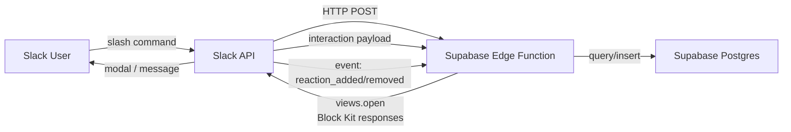
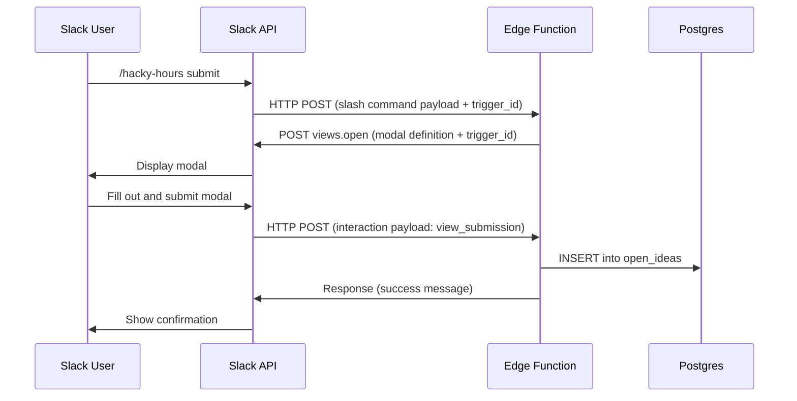
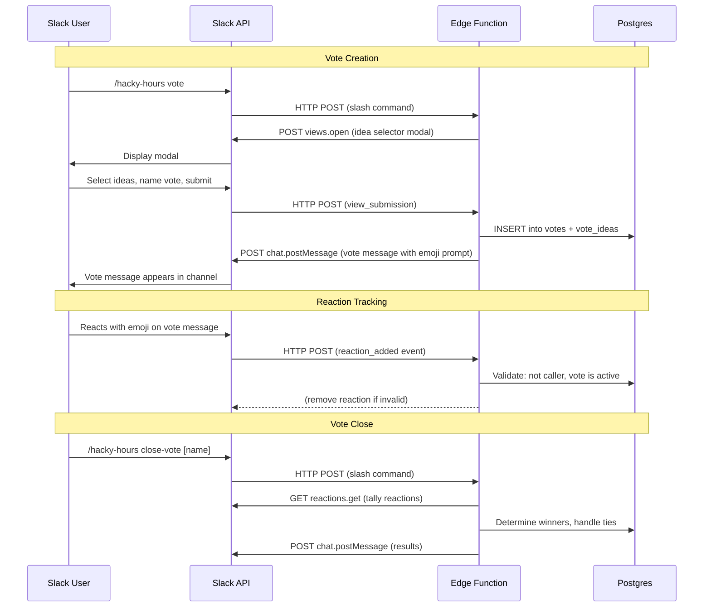

# ARCHITECTURE.md

**Level 2 — Design** | hacky-hours-bot

> **Note:** This document was rewritten as part of [ADR 2026-03-26: Switch to Supabase](decisions/2026-03-26-switch-to-supabase.md). The previous Apps Script + Google Sheets architecture is archived.

---

## System Overview

Two components on a single platform (Supabase), connected to Slack via HTTP:



**Flow summary:**
1. User types a slash command in Slack
2. Slack sends an HTTP POST to the Edge Function URL
3. Edge Function parses the command, queries/writes Postgres, and responds
4. For `/hacky-hours submit`: Edge Function calls back to Slack to open a modal, then handles the submission payload when the user completes it
5. For votes: Slack sends `reaction_added`/`reaction_removed` events for tracked vote messages

This is a **two-way integration** — the Edge Function both receives requests from Slack and calls back to the Slack API. As of v0.4.0, it also receives **Events API** callbacks for reaction tracking.

---

## Components

### 1. Slack App

**Role:** User interface — all interaction happens through Slack slash commands and modals.

**Configuration required:**
- Slash command (`/hacky-hours`) pointing to the Edge Function URL
- Interactivity Request URL (same Edge Function URL) for modal submissions
- Event Subscriptions URL (same Edge Function URL) for reaction events (v0.4.0+)
- Bot Event Subscriptions: `reaction_added`, `reaction_removed` (v0.4.0+)
- Bot Token Scopes: `commands`, `chat:write`, `channels:history`, `groups:history`, `reactions:read` (v0.4.0+)

**UI approach:** Block Kit for all responses. Modals for `submit`. Formatted blocks for `list`, `get`, `random`, `pick`.

### 2. Supabase Edge Function

**Role:** Runtime and business logic. Serverless function (Deno/TypeScript) deployed to Supabase's edge network.

**Responsibilities:**
- HTTP handler — entry point for all incoming requests (slash commands + interaction payloads)
- Verify request authenticity via Slack signing secret (HMAC-SHA256 — now possible since Edge Functions have full access to request headers)
- Route commands to handler functions
- Read/write Postgres via the Supabase client library
- Call Slack API (`views.open`) to launch modals
- Format responses using Block Kit JSON

**Key advantage over Apps Script:** Full access to HTTP request headers enables proper HMAC-SHA256 signing secret verification — the gold standard that was not possible in Apps Script.

### 3. Supabase Postgres

**Role:** Data store. Two tables in a single database.

- **`open_ideas`** — active ideas available for browsing/claiming
- **`closed_ideas`** — ideas that have been picked/claimed

Schema is defined in DATA_MODEL.md. Row Level Security is enabled on both tables.

---

## Configuration Surface

All configuration lives in **environment variables** set via the Supabase dashboard or CLI. Nothing is hardcoded — this is a template repo designed to be forked and configured per-deployment.

| Variable | Purpose | Source |
|----------|---------|--------|
| `SLACK_SIGNING_SECRET` | HMAC-SHA256 request verification | Slack App → Basic Information → Signing Secret |
| `SLACK_BOT_TOKEN` | Calling Slack API (e.g., `views.open`) | Slack App → OAuth & Permissions → Bot User OAuth Token |
| `SUPABASE_URL` | Supabase project URL | Supabase dashboard → Settings → API |
| `SUPABASE_SERVICE_ROLE_KEY` | Server-side database access (bypasses RLS) | Supabase dashboard → Settings → API → service_role key |

The Edge Function runs within Supabase's infrastructure, so `SUPABASE_URL` and `SUPABASE_SERVICE_ROLE_KEY` are automatically available as environment variables in Edge Functions — no manual configuration needed for these two.

---

## Request Verification

**Approach:** Slack Signing Secret with HMAC-SHA256 — Slack's recommended and current best practice.

**How it works:**
1. Slack sends `X-Slack-Signature` and `X-Slack-Request-Timestamp` headers with every request
2. Edge Function reconstructs the signature: `HMAC-SHA256(signing_secret, "v0:" + timestamp + ":" + raw_body)`
3. Compare computed signature to the header value — reject if mismatch
4. Reject if timestamp is more than 5 minutes old (replay protection)

**This was not possible in Apps Script** (no header access in `doPost`). Supabase Edge Functions have full access to request headers, so we can now implement the gold standard verification. See [ADR 2026-03-26](decisions/2026-03-26-switch-to-supabase.md) for context.

---

## Two-Way Integration: Modal Flow



The `trigger_id` is ephemeral (valid for ~3 seconds) — the `views.open` call must happen immediately in the initial request handler, not asynchronously.

---

## Thread Save Command

`/hacky-hours save [thread-link]` — formats a Slack thread as markdown and pre-fills the submit modal.

**Flow:**
1. User right-clicks a message in a thread → *Copy link*
2. User runs `/hacky-hours save <thread-link>`
3. Edge Function parses `channel_id` and `thread_ts` from the Slack URL
4. Calls `conversations.replies` to read the thread
5. Formats messages as markdown (username, timestamp, message text)
6. Opens the `submit` modal with the formatted thread pre-filled in `description`; `name` and `features` left blank for the user
7. User edits and submits as normal — reuses existing submit flow

**Why a thread link?** Slack slash commands do not include `thread_ts` in their payload, even when invoked from inside a thread. The URL is the only reliable way to pass thread context.

**Additional requirements:**
- Bot token scopes: `channels:history` (public), `groups:history` (private channels)
- One Slack API call: `conversations.replies`
- Thread URL format: `https://<workspace>.slack.com/archives/<channel_id>/p<timestamp>`

---

## Vote System (v0.4.0)

### Slack Events API Integration

The vote system requires the **Slack Events API** to track emoji reactions in real time. This is a new integration pattern — previous commands used only slash commands and interaction payloads.

**URL Verification:** When you first set the Event Subscriptions URL in the Slack app config, Slack sends a `url_verification` challenge. The Edge Function must respond with the challenge value to confirm ownership. This is a one-time handshake.

**Event flow:**


### Vote Command Flow

`/hacky-hours vote` — opens a modal to create a new vote session.

**Modal contents:**
- Vote name (text input, required) — unique identifier for this vote
- Idea selector (multi-select from open_ideas, required) — which ideas to vote on
- Duration (text input, optional) — e.g., "5m", "1h", "30s". NULL = manual close only.

**After submission:**
1. Validate max concurrent votes not exceeded (configurable, default 5)
2. Insert into `votes` and `vote_ideas` tables
3. Post a formatted message to the channel listing the ideas and prompting users to react with the designated emoji
4. The caller is noted in the message as the vote facilitator

### Close Vote Flow

`/hacky-hours close-vote [name]` — tallies reactions and determines the winner.

**Steps:**
1. Look up the vote by name
2. Only the caller can close the vote (or anyone if the vote has expired)
3. Call `reactions.get` on the vote message to get current reactions
4. Filter to the designated emoji, exclude the bot, exclude the caller
5. Count votes per idea (one vote per user — if a user reacted to multiple ideas, count all)
6. **Tie resolution:** If there's a tie for first place, ask the caller to choose:
   - Option 1: Bot decides (random selection among tied ideas)
   - Option 2: Caller decides (present tied ideas, caller picks)
7. Winning idea(s) go through the existing `pick` flow (move to `closed_ideas`)
8. Post results to the channel
9. Delete the vote record from the database

### Configuration

| Variable | Purpose | Default |
|----------|---------|---------|
| `MAX_OPEN_VOTES` | Maximum concurrent active votes | `5` |

---

## Runbooks

Setup documentation lives in the project **README.md** at the repo root. It must cover, in order:

1. **Fork and clone** the repo
2. **Create a Supabase project** — get project URL and API keys
3. **Run database migrations** — creates tables with RLS policies
4. **Create a Slack App** — configure slash command, interactivity URL, bot token scopes
5. **Deploy the Edge Function** — `supabase functions deploy`
6. **Set environment variables** — `SLACK_SIGNING_SECRET`, `SLACK_BOT_TOKEN`
7. **Connect** — set the Edge Function URL as the Slack slash command endpoint and interactivity URL
8. **Test** — verify with `/hacky-hours help` in Slack

---

## Development Workflow

```bash
# Start local development
supabase start                          # local Supabase stack (Postgres, Edge Functions)
supabase functions serve hacky-hours    # serve the function locally with hot reload

# Deploy
supabase db push                        # apply migrations to remote database
supabase functions deploy hacky-hours   # deploy the Edge Function

# Useful commands
supabase migration new <name>           # create a new migration file
supabase db reset                       # reset local database to migrations
supabase functions logs hacky-hours     # view function logs
```

---

## Design Decisions

- **Supabase over Apps Script + Google Sheets** — eliminates Google OAuth scope exposure, enables proper HMAC-SHA256 verification, single platform, modern TypeScript/Deno runtime. See [ADR 2026-03-26](decisions/2026-03-26-switch-to-supabase.md).
- **Edge Functions over a standalone server** — serverless, no infrastructure to maintain, deploys from the repo.
- **Block Kit over plain text** — better UX, structured formatting, modals for input.
- **Environment variables over hardcoded config** — enables the template/fork model. Every deployment is independent.
- **SQL migrations in the repo** — schema and RLS policies are version-controlled, reproducible, and reviewable.
