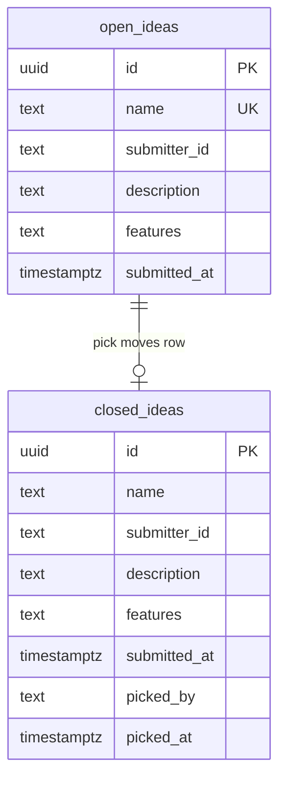

# DATA_MODEL.md

**Level 2 — Design** | hacky-hours-bot

> **Note:** Updated for Supabase Postgres. See [ADR 2026-03-26](decisions/2026-03-26-switch-to-supabase.md).

---

## Overview

All data lives in a single Supabase Postgres database with two tables. Ideas start in `open_ideas` and move to `closed_ideas` when claimed. No data is deleted — closing an idea is a move, not a delete.

Row Level Security (RLS) is enabled on both tables. All access goes through the `service_role` key via the Edge Function — no direct client access.



---

## Schema

### open_ideas

| Column | Type | Constraints | Notes |
|--------|------|-------------|-------|
| `id` | `uuid` | PRIMARY KEY, default `gen_random_uuid()` | Auto-generated unique ID |
| `name` | `text` | NOT NULL, UNIQUE | Idea title. Lookup key for `get` and `pick` commands. |
| `submitter_id` | `text` | NOT NULL | Slack user ID (e.g., `U024BE7LH`). Stable — doesn't change if the user renames their profile. |
| `description` | `text` | NOT NULL | What the idea is about. Free text. |
| `features` | `text` | | Desired features or scope. Free text. Optional. |
| `submitted_at` | `timestamptz` | NOT NULL, default `now()` | Timestamp when the idea was submitted. |

### closed_ideas

Same columns as `open_ideas`, plus:

| Column | Type | Constraints | Notes |
|--------|------|-------------|-------|
| `picked_by` | `text` | NOT NULL | Slack user ID of the person who claimed the idea. |
| `picked_at` | `timestamptz` | NOT NULL, default `now()` | Timestamp when the idea was picked. |

Note: `name` is NOT unique in `closed_ideas` — the same name could be resubmitted and picked multiple times over the life of the project.

---

## SQL Migration

This migration file will live in `supabase/migrations/` and be applied via `supabase db push`:

```sql
-- Create open_ideas table
CREATE TABLE open_ideas (
    id uuid PRIMARY KEY DEFAULT gen_random_uuid(),
    name text NOT NULL UNIQUE,
    submitter_id text NOT NULL,
    description text NOT NULL,
    features text DEFAULT '',
    submitted_at timestamptz NOT NULL DEFAULT now()
);

-- Create closed_ideas table
CREATE TABLE closed_ideas (
    id uuid PRIMARY KEY DEFAULT gen_random_uuid(),
    name text NOT NULL,
    submitter_id text NOT NULL,
    description text NOT NULL,
    features text DEFAULT '',
    submitted_at timestamptz NOT NULL,
    picked_by text NOT NULL,
    picked_at timestamptz NOT NULL DEFAULT now()
);

-- Enable Row Level Security on both tables
ALTER TABLE open_ideas ENABLE ROW LEVEL SECURITY;
ALTER TABLE closed_ideas ENABLE ROW LEVEL SECURITY;

-- Deny all access via the anon key (default deny)
-- The service_role key (used by Edge Functions) bypasses RLS by design.
-- No policies = no access for anon. This is intentional.
```

---

## Operations

| Command | Operation | SQL |
|---------|-----------|-----|
| `help` | None | None |
| `submit` | Insert | `INSERT INTO open_ideas (name, submitter_id, description, features) VALUES (...)` |
| `list [page]` | Read | `SELECT * FROM open_ideas ORDER BY submitted_at LIMIT 10 OFFSET (page-1)*10` |
| `get [name]` | Read | `SELECT * FROM open_ideas WHERE lower(name) = lower(...)` |
| `random` | Read | `SELECT * FROM open_ideas ORDER BY random() LIMIT 1` |
| `pick [name]` | Read + Insert + Delete | Find row, `INSERT INTO closed_ideas (...)`, `DELETE FROM open_ideas WHERE id = ...` |

---

## Constraints

- **`name` is the lookup key** — must be unique across `open_ideas`. The `UNIQUE` constraint enforces this at the database level. On `submit`, if the name already exists, Postgres returns an error which the Edge Function translates into a modal validation error ("An idea with this name already exists — try a different name"). The modal stays open with all other fields intact.
- **Pagination** — `list` returns 10 ideas per page. Page number is an optional parameter (default: 1). Footer includes "Page X of Y" and a hint for the next page command.
- **No editing** — once submitted, an idea can't be modified. Acceptable for MVP.
- **Move, not copy** — `pick` deletes the row from `open_ideas` and inserts it into `closed_ideas`. The original row is not preserved in `open_ideas`.
- **Case-insensitive lookup** — `get` and `pick` use `lower()` for name matching.
