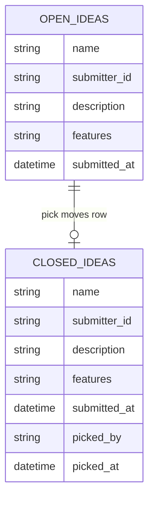

# DATA_MODEL.md

**Level 2 — Design** | hacky-hours-bot

---

## Overview

All data lives in a single Google Sheets spreadsheet with two tabs. Ideas start in "Open Ideas" and move to "Closed Ideas" when claimed. No data is deleted — closing an idea is a move, not a delete.

---

## Schema

### Open Ideas Tab

| Column | Type | Source | Notes |
|--------|------|--------|-------|
| `name` | String | User input (modal) | Idea title. Used as the lookup key for `get` and `pick` commands. |
| `submitter_id` | String | Slack payload (`user_id`) | Slack user ID (e.g., `U024BE7LH`). Stable — doesn't change if the user renames their profile. |
| `description` | String | User input (modal) | What the idea is about. Free text. |
| `features` | String | User input (modal) | Desired features or scope. Free text. |
| `submitted_at` | Datetime | Auto-generated | Timestamp when the idea was submitted. Set by Apps Script at write time (`new Date()`). |

### Closed Ideas Tab

Same columns as Open Ideas, plus:

| Column | Type | Source | Notes |
|--------|------|--------|-------|
| `picked_by` | String | Slack payload (`user_id`) | Slack user ID of the person who claimed the idea. |
| `picked_at` | Datetime | Auto-generated | Timestamp when the idea was picked. Set by Apps Script at move time. |

---

## Operations

| Command | Read/Write | Tab | Operation |
|---------|-----------|-----|-----------|
| `help` | None | None | Returns a static text response listing all commands |
| `submit` | Write | Open Ideas | Append a new row |
| `list [page]` | Read | Open Ideas | Read rows for the requested page (10 per page, default page 1). Footer: "Page X of Y" with next page hint. |
| `get [name]` | Read | Open Ideas | Find row by `name` column |
| `random` | Read | Open Ideas | Read all rows, return one at random |
| `pick [name]` | Write both | Open Ideas → Closed Ideas | Find row by `name`, delete from Open, append to Closed with `picked_by` and `picked_at` |

---

## Constraints

- **`name` is the lookup key** — must be unique across Open Ideas. On `submit`, Apps Script checks for duplicates before writing. If the name already exists, a validation error is returned on the modal's name field ("An idea with this name already exists — try a different name"). The modal stays open with all other fields intact so the user just fixes the name and resubmits.
- **Pagination** — `list` returns 10 ideas per page. Page number is an optional parameter (default: 1). Footer includes "Page X of Y" and a hint for the next page command.
- **No editing** — once submitted, an idea can't be modified. Acceptable for MVP.
- **Move, not copy** — `pick` deletes the row from Open Ideas and appends it to Closed Ideas. The original row is not preserved in Open Ideas.
